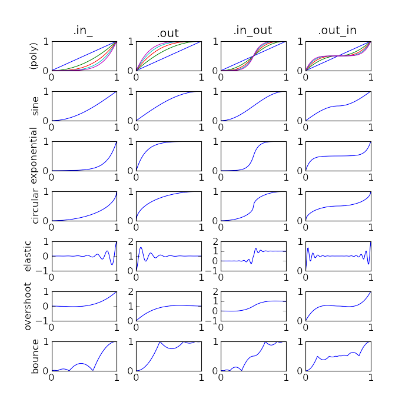

gillcup.easing
==============

.. module:: gillcup.easing

The easing module defines a number of functions usable in
:class:`gillcup.Animation`.

The functions are based on Robert Penner's `Motion, Tweening, and Easing
<http://robertpenner.com/easing/>`_, and on Qt's `QEasingCurve
<http://developer.qt.nokia.com/doc/qt-4.8/qeasingcurve.html>`_.
See their pages for more background.

Each of the functions defined here can be used directly for an
“ease in” animation (one that speeds up over time).
For other types, use attributes: **out** (slows down over time), **in_out**
(speeds up, then slows down), and **out_in** (slows down, then speeds up).
The ease-in is also available in **in_**. For example,
``gillcup.easing.quadratic.in_out`` is a nice natural-looking tween.

Polynomial easing functions
---------------------------

.. autofunction:: gillcup.easing.linear
.. autofunction:: gillcup.easing.quadratic
.. autofunction:: gillcup.easing.cubic
.. autofunction:: gillcup.easing.quartic
.. autofunction:: gillcup.easing.quintic

Other simple easing functions
-----------------------------

.. autofunction:: gillcup.easing.sine
.. autofunction:: gillcup.easing.exponential
.. autofunction:: gillcup.easing.circular

Easing factories
----------------

.. autofunction:: gillcup.easing.elastic
.. autofunction:: gillcup.easing.overshoot
.. autofunction:: gillcup.easing.bounce

Helpers for creating new easing functions
-----------------------------------------

.. autofunction:: gillcup.easing.easefunc
.. autofunction:: gillcup.easing.normalized

Graph
-----

For some visual reference, here are the graphs of the various functions in
this module.

The graph can be generated by running this module directly (i.e.
by ``python -m gillcup.easing``). If a command-line argument is given, the
graph will be saved to the given file, otherwise it will be displayed.
You'll need to install `matplotlib <http://matplotlib.sourceforge.net/>`_ to
create the graph.

